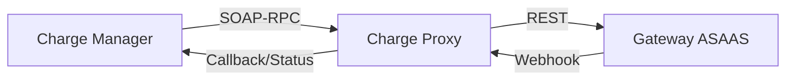

# Charge System 💳

## 📌 Sobre o Projeto

Sistema de integração de pagamentos projetado para gerenciar cobranças de forma automatizada, utilizando comunicação síncrona (SOAP/REST) e assíncrona (webhooks), garantindo consistência e atualização em tempo real dos dados financeiros.

## 🔄 Fluxo de Funcionamento

1. O Charge Manager solicita a criação de uma cobrança via SOAP
2. O Charge Proxy traduz a requisição para REST e envia ao ASAAS
3. O ASAAS processa a cobrança
4. Eventos de pagamento são enviados via webhook para o Proxy
5. O Proxy atualiza o Manager com o novo status da cobrança
6. O Manager atualiza o banco de dados com as novas informações

> [!IMPORTANT]
> **Pré-requisito Fundamental**: O usuário precisa ter uma conta no [Asaas Sandbox](https://sandbox.asaas.com/) criada para gerar a **Chave API** e configurar o **Webhook** com o seu respectivo **Token**. Sem essas credenciais, a integração com o gateway de pagamentos não funcionará.

## 🔐 Configuração de Secrets

O projeto utiliza Docker Secrets para gerenciar informações sensíveis. Abaixo estão os segredos necessários:

| Secret | Descrição |
| :--- | :--- |
| `DB_NAME` | Nome do banco de dados PostgreSQL. |
| `DB_USER_NAME` | Usuário do banco de dados. |
| `DB_PASSWORD` | Senha do banco de dados. |
| `ASAAS_SANDBOX_API_KEY` | Chave de API gerada no painel do Asaas Sandbox. |
| `ASAAS_WEBHOOK_TOKEN` | Token definido na configuração de Webhook do Asaas para validação. |
| `USER_MAIL` | Endereço de e-mail usado pelo Manager para envio de notificações. |

## 🏗️ Arquitetura

O sistema é dividido em dois serviços principais:

1.  **Charge Manager**: O núcleo da aplicação. Gerencia as regras de negócio, usuários e o estado das cobranças no banco de dados.
2.  **Charge Proxy**: Atua como uma camada de integração com serviços externos (ASAAS). Ele expõe uma interface **SOAP** para o Manager e traduz as requisições para APIs REST externas.

### Fluxo de Comunicação


## 🛠️ Tecnologias

- **Linguagem**: Java 17
- **Framework**: Spring Boot 3.5.9
- **Comunicação**: SOAP (JAX-WS) & REST (OpenFeign)
- **Banco de Dados**: PostgreSQL 15
- **Migrações**: Flyway
- **Infraestrutura**: Docker Swarm & Docker Stack
- **Outros**: Lombok, Spring Mail, Docker Secrets

## 🚀 Como Executar

### 1. Pré-requisitos
- Docker & Docker Desktop (com Swarm habilitado)
- Maven 3.8+
- Java 17

### 2. Configuração de Secrets
O projeto utiliza Docker Secrets para segurança. Você deve rodar os scripts de criação de secrets antes do deploy:

**Windows (PowerShell):**
```powershell
./create-docker-secrets.ps1
```

**Linux/macOS:**
```bash
chmod +x create-docker-secrets.sh
./create-docker-secrets.sh
```

### 3. Build das Imagens
Compile os projetos e gere as imagens locais:

```powershell
# No root do projeto
cd chargeProxy; ./mvnw clean package; cd ..
cd chargeManager; ./mvnw clean package; cd ..

# Build das imagens (ajuste as tags se necessário)
docker build -t rainan00/charge-proxy:latest ./chargeProxy
docker build -t rainan00/charge-manager:latest ./chargeManager
```

### 4. Deploy no Swarm
Inicialize o stack do sistema:

```powershell
docker stack deploy -c docker-stack.yml charge-system
```

## 📊 Serviços e Endpoints

### Charge Manager (`:8085`)
- Gerenciamento de cobranças e usuários.
- Envio de notificações por e-mail.
- **WSDL Consumida**: `http://charge-proxy:8089/ws/charge?wsdl`

### Charge Proxy (`:8082`, `:8089`)
- Interface SOAP para o Manager.
- Integração com o sandbox do ASAAS.
- Recebimento de Webhooks.

---
> [!IMPORTANT]
> Certifique-se de configurar a `ASAAS_SANDBOX_API_KEY` nos secrets para que o proxy funcione corretamente.
>

## 👨‍💻 Autores

Projeto desenvolvido por Rainan Jorge, Marcos Viana e Gabriel Monteiro como estudo prático de integração de sistemas e arquitetura de microserviços.
